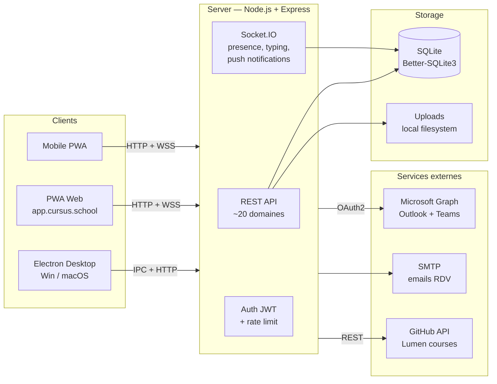

<div align="center">


# Cursus

### L'app tout-en-un pour ta promo

**Chat &middot; Devoirs &middot; Quiz &middot; Cours &middot; Rendez-vous**
<br />
Un seul endroit, plus de charge mentale.

<br />

[](https://github.com/rohanfosse/cursus/actions)
[](https://github.com/rohanfosse/cursus/releases)
[](LICENSE)
[](https://app.cursus.school)

<br />

[**Application**](https://app.cursus.school) &nbsp;&nbsp;&middot;&nbsp;&nbsp; [**Site web**](https://cursus.school) &nbsp;&nbsp;&middot;&nbsp;&nbsp; [**Telecharger**](https://github.com/rohanfosse/cursus/releases) &nbsp;&nbsp;&middot;&nbsp;&nbsp; [**Discussions**](https://github.com/rohanfosse/cursus/discussions)

<br />


</div>

<br />

> Les etudiants et enseignants jonglent entre 5 a 8 outils chaque jour : Moodle,
> Teams, WhatsApp, Drive, mails. Les annonces se perdent, les deadlines aussi,
> la frustration monte. **Cursus supprime cette charge mentale.** On ouvre
> l'app le matin et on n'a jamais a se demander "c'est ou ?".

<br />

## Pourquoi

<table>
<tr>
<td width="33%" valign="top">

### Un seul endroit

Chat, devoirs, documents, dashboard, quiz live, RDV. Plus besoin de jongler
entre 5 onglets ouverts.

</td>
<td width="33%" valign="top">

### Sur-mesure educatif

Types de devoirs specifiques, notation par rubriques, suivi de promo,
campagnes de visites tripartites. Pas un outil generique adapte.

</td>
<td width="33%" valign="top">

### Moins de logistique

Grilles d'evaluation, deadlines auto, notifications instantanees, sync
Outlook. Plus de temps pour la pedagogie.

</td>
</tr>
</table>

<br />

## Fonctionnalites

<table>
<tr>
<th>Module</th>
<th>Description</th>
</tr>

<tr>
<td valign="top">

**Chat temps reel**

</td>
<td>

Canaux par promotion (archivables), annonces lecture seule, DMs etudiants,
reactions, mentions <code>@nom</code> / <code>@tous</code>, slash commands
<code>/devoir</code> <code>/doc</code> <code>/annonce</code>, recherche
plein texte, indicateur de frappe, notifications desktop, **offline queue
avec retry**.

</td>
</tr>

<tr>
<td valign="top">

**Devoirs et evaluation**

</td>
<td>

5 types (livrable, soutenance, CCTL, etude de cas, memoire). Brouillon,
verrouillage post-deadline, **grilles multicriteres**, notation A-D,
feedback individuel, export CSV.

</td>
</tr>

<tr>
<td valign="top">

**Documents et ressources**

</td>
<td>

Upload avec validation (taille max 50 Mo, extensions bloquees), liens,
categorisation, viewers integres (PDF, Word, Excel), drag-and-drop,
recherche, liaison aux devoirs.

</td>
</tr>

<tr>
<td valign="top">

**Dashboard personnalisable**

</td>
<td>

Widgets reorganisables par drag-and-drop, deadlines proches, dernieres
notes, progression, calendrier. Vues dediees enseignant / etudiant.

</td>
</tr>

<tr>
<td valign="top">

**Lumen**<br /><sub>Liseuse de cours</sub>

</td>
<td>

Cours markdown adosses a GitHub (1 promo = 1 organisation, 1 cours = 1 repo).
Detection auto des chapitres, scaffold "Nouveau cours" en 1 clic,
**recherche FTS5**, KaTeX + Mermaid + admonitions, edition inline, notes
privees, tracking de lecture, **PDF integre** (pdf.js), **runner notebooks
.ipynb** (Pyodide).

</td>
</tr>

<tr>
<td valign="top">

**Live**<br /><sub>4 modes interactifs</sub>

</td>
<td>

Module unifie avec 4 categories :<br />
&middot; **Spark** &mdash; quiz QCM, vrai/faux, association, estimation,
reponse courte, scoring + podium<br />
&middot; **Pulse** &mdash; feedback anonyme : nuage de mots, echelle,
humeur, sondage, matrice, priorite<br />
&middot; **Code** &mdash; editeur live avec coloration syntaxique<br />
&middot; **Board** &mdash; brainstorming collaboratif, post-its, votes,
drag &amp; drop, export Markdown

</td>
</tr>

<tr>
<td valign="top">

**Rendez-vous**<br /><sub>mini-Calendly</sub>

</td>
<td>

Page dediee <code>/booking</code>. Types d'evenements, grille de
disponibilites hebdomadaire, lien de reservation par etudiant, sync
**Microsoft Outlook + Teams** ou **Jitsi Meet** (alternative libre),
emails de confirmation, rate limiting sur les routes publiques.

</td>
</tr>

<tr>
<td valign="top">

**Campagnes RDV**<br /><sub>visites tripartites</sub>

</td>
<td>

Planification automatique de visites prof + etudiant + tuteur entreprise
sur une periode donnee. Generation des creneaux a partir de regles
hebdomadaires, **invitations en 1 clic**, lien personnel par etudiant,
suivi en temps reel, relances automatiques.

</td>
</tr>

<tr>
<td valign="top">

**Kanban projet**

</td>
<td>

Suivi par groupe avec drag-and-drop (a faire, en cours, termine).
Synchronisation temps reel.

</td>
</tr>

<tr>
<td valign="top">

**Frise chronologique**

</td>
<td>

Timeline interactive des devoirs, zoom semaine / mois / trimestre / annee.

</td>
</tr>

<tr>
<td valign="top">

**Signature PDF**

</td>
<td>

Circuit de signature en DM avec tampon, reference unique, sauvegarde locale.

</td>
</tr>

<tr>
<td valign="top">

**DMs**<br /><sub>chiffres bout-en-bout au repos</sub>

</td>
<td>

Conversations privees chiffrees **AES-256-GCM**, indicateur en ligne,
envoi de fichiers, brouillons par conversation.

</td>
</tr>

<tr>
<td valign="top">

**Agenda et calendrier**

</td>
<td>

Reminders, deadlines, export ICS, sync Outlook bidirectionnelle.

</td>
</tr>

<tr>
<td valign="top">

**Mini-jeux**

</td>
<td>

TypeRace (vitesse de frappe), Snake, Space Invaders. Leaderboard par promo,
scopes <code>day</code> / <code>week</code> / <code>all</code>. Activable
par module dans l'admin.

</td>
</tr>

<tr>
<td valign="top">

**Mobile PWA**

</td>
<td>

Navigation tactile, barre inferieure, optimise pour petits ecrans, service
worker pour le mode hors-ligne.

</td>
</tr>
</table>

<br />

## Demarrage rapide

> **Prerequis** : [Node.js](https://nodejs.org/) 20+ (CI sur 22) et npm.

```bash
git clone https://github.com/rohanfosse/cursus.git
cd cursus
npm install
npm run dev
```

La base SQLite est creee automatiquement au premier lancement. Pour charger
des donnees de demonstration, ouvrir l'admin et cliquer sur **Reinitialiser
et peupler**.

<details>
<summary><b>Tous les scripts npm</b></summary>

| Commande                  | Description                                  |
|---------------------------|----------------------------------------------|
| `npm run dev`             | Electron + Vite HMR                          |
| `npm run dev:web`         | PWA web seulement (Vite, port 5174)          |
| `npm run server:dev`      | Serveur Express + Socket.IO en watch         |
| `npm run build`           | Build complet (main + preload + renderer)   |
| `npm run build:web`       | SPA web (PWA) dans `dist-web/`               |
| `npm run build:win`       | Packaging Windows (.exe NSIS)                |
| `npm run build:mac`       | Packaging macOS (.dmg)                       |
| `npm run server`          | Serveur Express en production                |
| `npm test`                | Tests Vitest (frontend + backend)            |
| `npm run test:e2e`        | Tests E2E Playwright                         |
| `npm run test:coverage`   | Tests + couverture (objectif 80%+)           |
| `npm run typecheck`       | Verification TypeScript stricte (vue-tsc)    |

</details>

<br />

## Architecture



<br />

## Stack technique

| Couche       | Technologies                                                                                                     |
|--------------|------------------------------------------------------------------------------------------------------------------|
| **Desktop**  | Electron 38, context isolation, sandbox, auto-update (electron-updater, NSIS)                                    |
| **Frontend** | Vue 3.5 Composition API, TypeScript strict, Pinia, Vue Router                                                    |
| **Backend**  | Express 4, Socket.IO 4, SQLite (Better-SQLite3), JWT, Zod, bcrypt, MSAL Node, nodemailer                          |
| **Build**    | electron-vite 3, Vite 6, electron-builder                                                                        |
| **Mobile**   | PWA, service worker, Web App Manifest                                                                            |
| **CI/CD**    | GitHub Actions (Vitest, Playwright, deploy Docker, release Win/macOS, Lighthouse, CodeQL, Dependabot)            |
| **Qualite**  | Vitest, Supertest, Playwright, vue-tsc strict                                                                    |

<details>
<summary><b>Structure du repo</b></summary>

```
cursus/
  src/
    main/              Processus principal Electron (IPC, DB, fenetre)
    preload/           Bridge IPC type-safe (contextBridge)
    renderer/          Frontend Vue 3 + TypeScript + Pinia
    web/               Shim PWA (remplace IPC par fetch + socket.io)
    landing/           Page vitrine cursus.school
  server/
    db/                SQLite : connexion, schema, migrations, models
    routes/            36 fichiers, ~20 domaines metier
    services/          Email (nodemailer), Microsoft Graph (MSAL), unfurl
    middleware/        Auth JWT, validation Zod, rate limit, role + promo
    public/            Console d'administration
  tests/
    frontend/          Tests unitaires utils + stores
    backend/           Tests models + routes + middleware + securite
    e2e/               Playwright (auth, isolation cross-promo)
```

</details>

<br />

## Securite

| Couche                  | Mecanisme                                                                                                |
|-------------------------|----------------------------------------------------------------------------------------------------------|
| **Isolation promo**     | Middleware `requirePromo` + rooms Socket.IO par promotion                                                |
| **Controle par role**   | 4 roles hierarchiques (admin > enseignant > intervenant > etudiant), permissions centralisees            |
| **DMs confidentiels**   | `requireDmParticipant` + chiffrement AES-256-GCM au repos                                                |
| **Auth + chiffrement**  | JWT 7j, bcrypt 10 rounds, validation Zod, CSRF (OAuth state HMAC), CSP stricte, tokens MS chiffres       |
| **IPC securise**        | `contextIsolation`, `sandbox`, `nodeIntegration: false`, verifications role + promo dans les handlers   |
| **RGPD**                | Export des donnees personnelles (Art. 20), suppression de compte                                         |

Pour signaler une vulnerabilite : [SECURITY.md](SECURITY.md).

<br />

## Deploiement

### Docker (recommande)

```bash
docker compose build
docker compose up -d
docker logs -f cursus-server
```

### Manuel

```bash
npm run build:web
NODE_ENV=production PORT=3001 JWT_SECRET=<secret-32-chars> node server/index.js
```

<details>
<summary><b>Variables d'environnement</b></summary>

| Variable               | Description                                | Defaut                  |
|------------------------|--------------------------------------------|-------------------------|
| `PORT`                 | Port HTTP                                  | `3001`                  |
| `JWT_SECRET`           | Cle JWT (min 32 chars en prod)             | `changeme-dev-secret`   |
| `CORS_ORIGIN`          | Origine CORS                               | `*`                     |
| `DB_PATH`              | Chemin SQLite                              | Auto                    |
| `UPLOAD_DIR`           | Repertoire uploads                         | `uploads/`              |
| `VITE_SERVER_URL`      | URL serveur pour le frontend               | `http://localhost:3001` |
| `AZURE_TENANT_ID`      | Azure AD tenant ID (booking)               | -                       |
| `AZURE_CLIENT_ID`      | Azure AD client ID (booking)               | -                       |
| `AZURE_CLIENT_SECRET`  | Azure AD client secret (booking)           | -                       |
| `SMTP_HOST`            | Serveur SMTP (emails RDV)                  | -                       |
| `SMTP_USER`            | Utilisateur SMTP                           | -                       |
| `SMTP_PASS`            | Mot de passe SMTP                          | -                       |

</details>

### Infrastructure live

| Service        | Domaine                                                              |
|----------------|----------------------------------------------------------------------|
| Application    | [app.cursus.school](https://app.cursus.school)                       |
| Page vitrine   | [cursus.school](https://cursus.school)                               |
| Administration | [admin.cursus.school](https://admin.cursus.school)                   |

Docker + Nginx + Let's Encrypt sur VPS. Deploy automatique via GitHub Actions
sur chaque push `main`.

<br />

## Contribuer

Les contributions sont les bienvenues. Voir [CONTRIBUTING.md](CONTRIBUTING.md)
pour le workflow detaille.

```bash
git checkout -b feat/ma-feature   # branche descriptive
npm run dev                       # dev avec HMR
npm test                          # tests
npx vue-tsc --noEmit              # types
git push origin feat/ma-feature   # ouvrir une PR vers main
```

**Conventions** : commits prefixes (`feat:`, `fix:`, `docs:`, `chore:`,
`refactor:`, `test:`), TypeScript strict, Composition API, variables CSS
(pas de couleurs hardcodees), pas d'emojis dans l'UI ni les commits.

<br />

## Licence

Distribue sous licence [MIT](LICENSE) &middot; &copy; 2025-2026
[Rohan Fosse](https://github.com/rohanfosse).

<br />

<div align="center">

<sub>
Concu et developpe avec soin par <a href="https://github.com/rohanfosse">@rohanfosse</a>.
<br />
Si Cursus te plait, mets une <a href="https://github.com/rohanfosse/cursus/stargazers">etoile</a> sur GitHub &mdash; ca aide enormement.
</sub>

</div>
